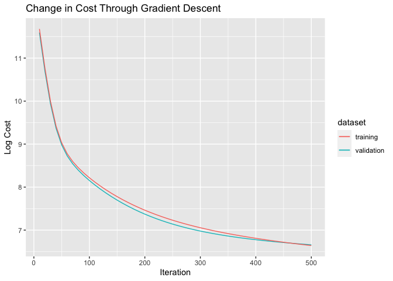

<!-- README.md is generated from README.Rmd. Please edit that file -->

# linProt

<!-- badges: start -->
<!-- badges: end -->

## Description

This package provides a pipeline that allows for that training and
evaluation of linear models for protein function prediction from user
provided labelled AA sequences. This package provides visualizations of
the patterns learned by the linear models and provides functions that
can be used to generate novel proteins with optimised functional
characteristics.

## Installation

``` r
# install.packages("devtools")
devtools::install_github("benz0id/linProt", build_vignettes = TRUE)
library("linProt")
```

## Overview

``` r
ls("package:linProt")
data(package = "linProt")
browseVignettes("linProt")
```

This package works with continuously distributed protein functional
characteristics, such as peak light absorption wavelength or
fluorescence.

In the context of protein function prediction, linear models assign
weights to each of the amino acid positions along an alignment. We can
interpret these weights to gain insight into how residues contribute to
the protein’s function and use the model to make predictions on unseen
sequences.

This model takes a list of aligned amino acid sequences, each with a
label denoting their experimentally determined function. These sequences
are then encoded as either as A x 20 one hot matricies (where A is the
number of residues in the aligned protein) or as A x 8 matricies, using
the VHSE8 scores of each residue. After being partitioned into training
and validation sets, these encoded data are then used to train a
regularised linear model.

This trained linear model can be used for the function prediction of
novel sequences, the design of maximally or minimally functional
proteins, or to gain insight into the functional characteristics of the
protein.

In order to achieve this, the package implements 8 functions that can be
ordered form a modular pipeline. These include:

***shuffled_partitions*** - Shuffle, partition, and encode the supplied
peptide alignment using one of the following encoding functions

***encode_onehot*** - Encode a peptide alignment as a tensor of one-hot
vectors.

***encode_physchem*** - Encode a peptide alignment as a tensor of
vectors encoded by the VHSE matrix.

***linear_train*** - Train and return a linear model that predicts
protein function on using some training and validation data given some
hyperparameters.

***predictions*** - Use a linear model to make function predictions for
some aligned peptide sequences.

***maximal_sequence*** - Create a peptide that would have the maximum
(or minimum) possible function as predicted by some model.

***plot_cost_over_rep*** - Show the change in cost over the duration of
some linear model’s training cycles. Helpful for discovering
overfitting.

***property_effect_heatmap*** - Using the weights supplied by a model
trained on VHSE8 encoded peptides, show the learned effect of each VHSE
on protein function.

***residue_effect_heatmap*** - Using the weights supplied by a model
trained on one hot encoded peptides, show the learned effects that
having any given residue at any given position will have on protein
function.


## Example

With this package, you can easily generate, evaluate, and use linear
models for protein function/fitness predictionn tasks.

Here, we generate a linear model to peodict the absorption properties of
various aligned channel rhodopin proteins using the provided dataset.

``` r
library(linProt)
data(rhoData)

examples <- rhoData$data
labels <- rhoData$labels

examples[1]
#> $`1`
#> [1] "--------------------------------------------------mfai----npeymn---------------------------et----vlld-------ec--tpiy-----ldigplweqvvar--vtqwfg-vilslvfliyyiwntykatcg-weelyvctvefckiiielyf-eytppam-------------------ifqtngqvtpwlryaewlltcpvilihls-nitgl--------ndd---ysgrtms-litsdlggicmavtaalsk-------g-----wlka-lffvigcg-ygastfynaaciyiesy----------------y------------------tm--p---qgicrrlvlwmagvfftswfmfpglflagpe-gtq---------al-swagttightvadllsknawgmighflrveihkhiiihgd-------vrrpvtvkalgrqvsvncfvdke------eeeederi--------"
labels[1]
#> [1] 436

# Shuffle, partition, and encode data set.
shuffled_datasets <- shuffled_partitions(examples, labels, num_p1 = 650,
                                        encode=encode_onehot)

# Train a linear model to perform regression.
model <- linear_train(train_data = shuffled_datasets$e1,
                      train_labels = shuffled_datasets$l1,
                      valid_data = shuffled_datasets$e2,
                      valid_labels = shuffled_datasets$l2)

# View the expected influence of each residue on the function, (lambda max
# in this case).

residue_effect_heatmap(model, 380, 410)
```


    #> $rowInd
    #>  [1] 20 19 18 17 16 15 14 13 12 11 10  9  8  7  6  5  4  3  2  1
    #> 
    #> $colInd
    #>  [1]  1  2  3  4  5  6  7  8  9 10 11 12 13 14 15 16 17 18 19 20 21 22 23 24 25
    #> [26] 26 27 28 29 30 31
    #> 
    #> $call
    #> heatmap.2(x = sel_w, Rowv = FALSE, Colv = FALSE, dendrogram = "none", 
    #>     scale = "none", col = bluered(100), trace = "none", density.info = "none", 
    #>     key.xlab = "", key.ylab = "", main = "Effect of Amino\n            Acid prescence on Function", 
    #>     xlab = "Aligned Residue #", ylab = "Amino Acid")
    #> 
    #> $carpet
    #>              Y          W           V           T          S         R
    #> 380 0.00000000 0.00000000 0.776982818  0.28208231 0.88175044 1.9141784
    #> 381 0.00000000 0.00000000 0.192576944  0.26225539 1.41964021 0.8426261
    #> 382 0.00000000 0.38880650 0.543107313  0.99407672 0.00000000 0.5062069
    #> 383 2.45168727 0.00000000 1.255385696  0.00000000 0.00000000 0.0000000
    #> 384 0.00000000 0.00000000 0.342050543  1.28217532 1.07171586 1.3514049
    #> 385 0.04370546 0.00000000 0.456277724  1.78954925 0.04572759 0.8816799
    #> 386 0.00000000 0.00000000 0.530906930  0.08862773 0.00000000 0.0000000
    #> 387 0.00000000 1.02806849 0.691767643 -0.01961293 0.00000000 2.4021721
    #> 388 0.89062426 1.91663034 0.580240717  0.38272681 0.08736601 0.0000000
    #> 389 1.78430486 0.00000000 0.848160547  0.30064810 0.00000000 0.0000000
    #> 390 0.33329010 0.00000000 1.375173704  1.65413354 0.00000000 0.0000000
    #> 391 0.40586652 0.00000000 1.401305680  1.45357297 0.00000000 0.0000000
    #> 392 0.00000000 0.00000000 5.098614341  0.00000000 0.00000000 0.0000000
    #> 393 0.00000000 0.00000000 0.127423807  0.08554989 2.31185766 0.0000000
    #> 394 0.00000000 8.90667639 0.000000000  0.00000000 0.00000000 0.0000000
    #> 395 0.00000000 0.00000000 0.911575595  0.43211019 0.39949516 0.0000000
    #> 396 0.00000000 0.00000000 0.185725862  0.18491360 0.57617256 0.0000000
    #> 397 7.96080888 0.00000000 0.000000000  0.00000000 0.00000000 0.0000000
    #> 398 0.00000000 0.00000000 0.008326578  0.00000000 0.00000000 0.0000000
    #> 399 0.00000000 0.00000000 1.666302135  0.00000000 0.00000000 0.0000000
    #> 400 0.00000000 0.03517749 4.262935605  0.00000000 0.00000000 0.0000000
    #> 401 3.07670202 4.61018280 0.000000000 -0.05822563 0.00000000 0.0000000
    #> 402 0.00000000 0.00000000 0.199841181  0.00000000 0.40586652 0.0000000
    #> 403 0.05328915 0.04377853 1.579970129  0.47885168 0.00000000 0.0000000
    #> 404 0.00000000 0.00000000 0.000000000  0.16556065 1.13570014 0.0000000
    #> 405 0.88747246 0.00000000 0.676825192  0.58699818 0.84455423 0.3428859
    #> 406 0.00000000 0.08862773 0.184913603  0.50620686 0.81236920 0.0000000
    #> 407 0.00000000 0.00000000 0.000000000  0.14840548 0.00000000 0.0000000
    #> 408 0.00000000 0.00000000 0.000000000  0.05328915 0.00000000 0.0000000
    #> 409 0.00000000 0.26387818 0.638662478  0.00000000 0.04844940 0.0000000
    #> 410 0.26387818 0.21678479 0.000000000  0.38880650 0.12630973 0.1670077
    #>              Q         P            N          M          L         K
    #> 380 1.30650723 0.0000000  0.050219155 0.00000000 0.08862773 0.4479290
    #> 381 0.49701829 0.2167848  0.525771557 0.14653017 0.19984118 1.3737923
    #> 382 0.00000000 0.0000000  0.000000000 0.27403751 3.06115878 0.0000000
    #> 383 0.00000000 0.3888065  0.000000000 0.09961506 1.38858585 0.0000000
    #> 384 0.04572759 0.0000000  1.502919501 0.00000000 0.25293637 1.6926780
    #> 385 0.00000000 0.0000000  1.197900156 0.18770634 1.91456062 0.9416687
    #> 386 0.00000000 0.0000000  0.309031116 2.36115616 4.10490938 0.0000000
    #> 387 0.04554017 0.0000000  0.000000000 0.49038959 0.87131309 1.1748499
    #> 388 0.00000000 0.0000000  2.047746954 0.09691529 0.71783519 0.0000000
    #> 389 0.00000000 0.0000000  0.000000000 0.00000000 3.01741078 0.0000000
    #> 390 0.00000000 0.0000000  0.000000000 0.10126454 1.52482284 0.0000000
    #> 391 0.00000000 0.0000000  0.005459585 0.10126454 2.00280532 0.0000000
    #> 392 0.00000000 0.0000000  0.000000000 0.08862773 1.75514734 0.0000000
    #> 393 0.00000000 0.0000000  0.000000000 0.27403751 3.59071390 0.0000000
    #> 394 0.00000000 0.0000000  0.000000000 0.05239168 0.00000000 0.0000000
    #> 395 0.00000000 0.0000000  0.000000000 0.45160382 2.37405612 0.0000000
    #> 396 0.00000000 0.0000000  0.000000000 0.97825275 1.21052383 0.0000000
    #> 397 0.00000000 0.0000000 -0.018136458 0.00000000 0.00000000 0.0000000
    #> 398 0.00000000 8.7183457  0.000000000 0.00000000 0.19984118 0.0000000
    #> 399 0.00000000 0.0000000  0.000000000 0.00000000 2.11605037 0.0000000
    #> 400 0.00000000 0.0000000  0.000000000 0.08029965 1.41008183 0.0000000
    #> 401 0.00000000 0.0000000  0.000000000 0.00000000 0.00000000 0.0000000
    #> 402 0.00000000 0.0000000  0.000000000 0.45275248 3.61874028 0.0000000
    #> 403 0.00000000 0.0000000  0.000000000 0.63925228 2.65117724 0.0000000
    #> 404 0.00000000 1.3449117  0.000000000 0.00000000 0.09961506 0.1849136
    #> 405 0.38880650 3.4524194  0.184913603 0.21555926 0.16556065 0.0000000
    #> 406 0.19984118 0.2974644  0.000000000 0.05355800 1.78347321 0.0000000
    #> 407 0.00000000 0.0000000  0.000000000 0.52908056 0.00000000 0.0000000
    #> 408 0.00000000 0.0000000  0.099615058 0.10126454 0.04208025 0.0000000
    #> 409 0.00000000 0.2969001  0.089168768 0.00000000 1.89716739 0.0000000
    #> 410 0.58922106 0.0000000  0.189787709 0.00000000 0.33422960 0.0922366
    #>                I           H            G          F          E         D
    #> 380  0.673288943  0.00000000 -0.006199608 0.00000000 0.08736601 0.1012645
    #> 381 -0.006199608  0.00000000  1.140304289 0.00000000 1.18031116 0.4833231
    #> 382  1.156281162  0.00000000  0.000000000 0.10060314 0.00000000 0.0000000
    #> 383  0.201604883  0.35195284  0.000000000 2.15183154 0.00000000 0.0000000
    #> 384  0.000000000  0.00000000  0.504093430 0.09961506 0.00000000 0.7855145
    #> 385  0.350625195  0.00000000  0.469166650 0.00000000 0.00000000 0.0000000
    #> 386  1.164726318  0.00000000  0.000000000 0.00000000 0.00000000 0.0000000
    #> 387  0.000000000  0.04359598  0.187978865 0.10126454 0.00000000 0.0000000
    #> 388  1.395456295  0.00000000  0.265243909 0.00000000 0.00000000 0.0000000
    #> 389  0.835173160  0.67328894  0.000000000 1.31339222 0.00000000 0.0000000
    #> 390  1.326970847  0.00000000  0.000000000 2.57695932 0.00000000 0.0000000
    #> 391  0.955325308  0.00000000  1.209109870 1.12479264 0.00000000 0.0000000
    #> 392  0.606712307  0.00000000 -0.006199608 0.66750167 0.00000000 0.0000000
    #> 393  0.000000000  0.00000000  1.343589214 0.81844888 0.00000000 0.0000000
    #> 394  0.000000000  0.00000000  0.000000000 0.00000000 0.00000000 0.0000000
    #> 395  0.656513514  0.00000000  1.450405638 0.60266696 0.00000000 0.0000000
    #> 396  2.190765413  0.00000000  1.139230862 0.17787726 0.00000000 0.0000000
    #> 397  0.000000000 -0.04581864  0.000000000 1.07212635 0.00000000 0.0000000
    #> 398  0.009298674  0.00000000  0.000000000 0.00000000 0.00000000 0.0000000
    #> 399  4.038275805  0.00000000  0.639252280 0.42636100 0.00000000 0.0000000
    #> 400  0.291414874  0.00000000  1.343589214 0.00000000 0.00000000 0.0000000
    #> 401  0.000000000  0.00000000  0.143444042 1.18695324 0.00000000 0.0000000
    #> 402  1.302745687  0.00000000  0.536475482 0.58571827 0.00000000 0.0000000
    #> 403  1.511429309  0.00000000  0.000000000 1.58224882 0.00000000 0.0000000
    #> 404  0.000000000  0.00000000  5.750660992 0.00000000 0.00000000 0.0000000
    #> 405  0.000000000  0.55852070  0.066394874 0.00000000 0.08736601 0.1006031
    #> 406  0.000000000  0.00000000  1.219136393 0.31062315 2.73366143 0.1822412
    #> 407  0.000000000  0.00000000  0.438905143 0.00000000 0.00000000 0.0000000
    #> 408  0.000000000  0.00000000  7.137053345 0.08923981 0.00000000 0.0000000
    #> 409  1.881265277  0.38880650  0.658416385 1.39093944 0.00000000 0.4909475
    #> 410  0.000000000  0.28208231  3.608824931 0.00000000 0.61768973 0.2569709
    #>                C           A
    #> 380  0.005485131  1.99751156
    #> 381  0.013917428  0.47044350
    #> 382  0.000000000  1.93472207
    #> 383  0.080299649  0.58922106
    #> 384  0.028139769  0.00000000
    #> 385  0.019481880  0.66091172
    #> 386  0.117745738  0.28190640
    #> 387  0.382663924  1.55897313
    #> 388  0.023758881  0.55442626
    #> 389  0.026523164  0.16009828
    #> 390  0.000000000  0.06639487
    #> 391  0.024374089  0.27510411
    #> 392  0.124014825  0.62459591
    #> 393  0.029875372  0.37750382
    #> 394  0.000000000  0.00000000
    #> 395  0.000000000  1.68057306
    #> 396  0.015002636  2.30052556
    #> 397 -0.009900330  0.00000000
    #> 398  0.036517521 -0.01328662
    #> 399  0.022558738  0.05021916
    #> 400  0.000000000  1.53552083
    #> 401  0.000000000  0.00000000
    #> 402  0.000000000  1.85686988
    #> 403  0.020416688  0.39857651
    #> 404  0.023264148  0.25438345
    #> 405 -0.007522089  0.40758550
    #> 406 -0.013507715  0.60035642
    #> 407  0.000000000  0.15259417
    #> 408  0.008159127  0.21210813
    #> 409  0.025574250  0.79554191
    #> 410  0.515552912  1.21631545
    #> 
    #> $rowDendrogram
    #> 'dendrogram' with 2 branches and 20 members total, at height 1.414214 
    #> 
    #> $colDendrogram
    #> 'dendrogram' with 2 branches and 31 members total, at height 1.414214 
    #> 
    #> $breaks
    #>   [1] -8.9066764 -8.7285429 -8.5504093 -8.3722758 -8.1941423 -8.0160088
    #>   [7] -7.8378752 -7.6597417 -7.4816082 -7.3034746 -7.1253411 -6.9472076
    #>  [13] -6.7690741 -6.5909405 -6.4128070 -6.2346735 -6.0565399 -5.8784064
    #>  [19] -5.7002729 -5.5221394 -5.3440058 -5.1658723 -4.9877388 -4.8096053
    #>  [25] -4.6314717 -4.4533382 -4.2752047 -4.0970711 -3.9189376 -3.7408041
    #>  [31] -3.5626706 -3.3845370 -3.2064035 -3.0282700 -2.8501364 -2.6720029
    #>  [37] -2.4938694 -2.3157359 -2.1376023 -1.9594688 -1.7813353 -1.6032018
    #>  [43] -1.4250682 -1.2469347 -1.0688012 -0.8906676 -0.7125341 -0.5344006
    #>  [49] -0.3562671 -0.1781335  0.0000000  0.1781335  0.3562671  0.5344006
    #>  [55]  0.7125341  0.8906676  1.0688012  1.2469347  1.4250682  1.6032018
    #>  [61]  1.7813353  1.9594688  2.1376023  2.3157359  2.4938694  2.6720029
    #>  [67]  2.8501364  3.0282700  3.2064035  3.3845370  3.5626706  3.7408041
    #>  [73]  3.9189376  4.0970711  4.2752047  4.4533382  4.6314717  4.8096053
    #>  [79]  4.9877388  5.1658723  5.3440058  5.5221394  5.7002729  5.8784064
    #>  [85]  6.0565399  6.2346735  6.4128070  6.5909405  6.7690741  6.9472076
    #>  [91]  7.1253411  7.3034746  7.4816082  7.6597417  7.8378752  8.0160088
    #>  [97]  8.1941423  8.3722758  8.5504093  8.7285429  8.9066764
    #> 
    #> $col
    #>   [1] "#0000FF" "#0505FF" "#0A0AFF" "#1010FF" "#1515FF" "#1A1AFF" "#1F1FFF"
    #>   [8] "#2424FF" "#2A2AFF" "#2F2FFF" "#3434FF" "#3939FF" "#3E3EFF" "#4444FF"
    #>  [15] "#4949FF" "#4E4EFF" "#5353FF" "#5858FF" "#5E5EFF" "#6363FF" "#6868FF"
    #>  [22] "#6D6DFF" "#7272FF" "#7878FF" "#7D7DFF" "#8282FF" "#8787FF" "#8D8DFF"
    #>  [29] "#9292FF" "#9797FF" "#9C9CFF" "#A1A1FF" "#A7A7FF" "#ACACFF" "#B1B1FF"
    #>  [36] "#B6B6FF" "#BBBBFF" "#C1C1FF" "#C6C6FF" "#CBCBFF" "#D0D0FF" "#D5D5FF"
    #>  [43] "#DBDBFF" "#E0E0FF" "#E5E5FF" "#EAEAFF" "#EFEFFF" "#F5F5FF" "#FAFAFF"
    #>  [50] "#FFFFFF" "#FFFFFF" "#FFFAFA" "#FFF5F5" "#FFEFEF" "#FFEAEA" "#FFE5E5"
    #>  [57] "#FFE0E0" "#FFDBDB" "#FFD5D5" "#FFD0D0" "#FFCBCB" "#FFC6C6" "#FFC1C1"
    #>  [64] "#FFBBBB" "#FFB6B6" "#FFB1B1" "#FFACAC" "#FFA7A7" "#FFA1A1" "#FF9C9C"
    #>  [71] "#FF9797" "#FF9292" "#FF8D8D" "#FF8787" "#FF8282" "#FF7D7D" "#FF7878"
    #>  [78] "#FF7272" "#FF6D6D" "#FF6868" "#FF6363" "#FF5E5E" "#FF5858" "#FF5353"
    #>  [85] "#FF4E4E" "#FF4949" "#FF4444" "#FF3E3E" "#FF3939" "#FF3434" "#FF2F2F"
    #>  [92] "#FF2A2A" "#FF2424" "#FF1F1F" "#FF1A1A" "#FF1515" "#FF1010" "#FF0A0A"
    #>  [99] "#FF0505" "#FF0000"
    #> 
    #> $colorTable
    #>            low       high   color
    #> 1   -8.9066764 -8.7285429 #0000FF
    #> 2   -8.7285429 -8.5504093 #0505FF
    #> 3   -8.5504093 -8.3722758 #0A0AFF
    #> 4   -8.3722758 -8.1941423 #1010FF
    #> 5   -8.1941423 -8.0160088 #1515FF
    #> 6   -8.0160088 -7.8378752 #1A1AFF
    #> 7   -7.8378752 -7.6597417 #1F1FFF
    #> 8   -7.6597417 -7.4816082 #2424FF
    #> 9   -7.4816082 -7.3034746 #2A2AFF
    #> 10  -7.3034746 -7.1253411 #2F2FFF
    #> 11  -7.1253411 -6.9472076 #3434FF
    #> 12  -6.9472076 -6.7690741 #3939FF
    #> 13  -6.7690741 -6.5909405 #3E3EFF
    #> 14  -6.5909405 -6.4128070 #4444FF
    #> 15  -6.4128070 -6.2346735 #4949FF
    #> 16  -6.2346735 -6.0565399 #4E4EFF
    #> 17  -6.0565399 -5.8784064 #5353FF
    #> 18  -5.8784064 -5.7002729 #5858FF
    #> 19  -5.7002729 -5.5221394 #5E5EFF
    #> 20  -5.5221394 -5.3440058 #6363FF
    #> 21  -5.3440058 -5.1658723 #6868FF
    #> 22  -5.1658723 -4.9877388 #6D6DFF
    #> 23  -4.9877388 -4.8096053 #7272FF
    #> 24  -4.8096053 -4.6314717 #7878FF
    #> 25  -4.6314717 -4.4533382 #7D7DFF
    #> 26  -4.4533382 -4.2752047 #8282FF
    #> 27  -4.2752047 -4.0970711 #8787FF
    #> 28  -4.0970711 -3.9189376 #8D8DFF
    #> 29  -3.9189376 -3.7408041 #9292FF
    #> 30  -3.7408041 -3.5626706 #9797FF
    #> 31  -3.5626706 -3.3845370 #9C9CFF
    #> 32  -3.3845370 -3.2064035 #A1A1FF
    #> 33  -3.2064035 -3.0282700 #A7A7FF
    #> 34  -3.0282700 -2.8501364 #ACACFF
    #> 35  -2.8501364 -2.6720029 #B1B1FF
    #> 36  -2.6720029 -2.4938694 #B6B6FF
    #> 37  -2.4938694 -2.3157359 #BBBBFF
    #> 38  -2.3157359 -2.1376023 #C1C1FF
    #> 39  -2.1376023 -1.9594688 #C6C6FF
    #> 40  -1.9594688 -1.7813353 #CBCBFF
    #> 41  -1.7813353 -1.6032018 #D0D0FF
    #> 42  -1.6032018 -1.4250682 #D5D5FF
    #> 43  -1.4250682 -1.2469347 #DBDBFF
    #> 44  -1.2469347 -1.0688012 #E0E0FF
    #> 45  -1.0688012 -0.8906676 #E5E5FF
    #> 46  -0.8906676 -0.7125341 #EAEAFF
    #> 47  -0.7125341 -0.5344006 #EFEFFF
    #> 48  -0.5344006 -0.3562671 #F5F5FF
    #> 49  -0.3562671 -0.1781335 #FAFAFF
    #> 50  -0.1781335  0.0000000 #FFFFFF
    #> 51   0.0000000  0.1781335 #FFFFFF
    #> 52   0.1781335  0.3562671 #FFFAFA
    #> 53   0.3562671  0.5344006 #FFF5F5
    #> 54   0.5344006  0.7125341 #FFEFEF
    #> 55   0.7125341  0.8906676 #FFEAEA
    #> 56   0.8906676  1.0688012 #FFE5E5
    #> 57   1.0688012  1.2469347 #FFE0E0
    #> 58   1.2469347  1.4250682 #FFDBDB
    #> 59   1.4250682  1.6032018 #FFD5D5
    #> 60   1.6032018  1.7813353 #FFD0D0
    #> 61   1.7813353  1.9594688 #FFCBCB
    #> 62   1.9594688  2.1376023 #FFC6C6
    #> 63   2.1376023  2.3157359 #FFC1C1
    #> 64   2.3157359  2.4938694 #FFBBBB
    #> 65   2.4938694  2.6720029 #FFB6B6
    #> 66   2.6720029  2.8501364 #FFB1B1
    #> 67   2.8501364  3.0282700 #FFACAC
    #> 68   3.0282700  3.2064035 #FFA7A7
    #> 69   3.2064035  3.3845370 #FFA1A1
    #> 70   3.3845370  3.5626706 #FF9C9C
    #> 71   3.5626706  3.7408041 #FF9797
    #> 72   3.7408041  3.9189376 #FF9292
    #> 73   3.9189376  4.0970711 #FF8D8D
    #> 74   4.0970711  4.2752047 #FF8787
    #> 75   4.2752047  4.4533382 #FF8282
    #> 76   4.4533382  4.6314717 #FF7D7D
    #> 77   4.6314717  4.8096053 #FF7878
    #> 78   4.8096053  4.9877388 #FF7272
    #> 79   4.9877388  5.1658723 #FF6D6D
    #> 80   5.1658723  5.3440058 #FF6868
    #> 81   5.3440058  5.5221394 #FF6363
    #> 82   5.5221394  5.7002729 #FF5E5E
    #> 83   5.7002729  5.8784064 #FF5858
    #> 84   5.8784064  6.0565399 #FF5353
    #> 85   6.0565399  6.2346735 #FF4E4E
    #> 86   6.2346735  6.4128070 #FF4949
    #> 87   6.4128070  6.5909405 #FF4444
    #> 88   6.5909405  6.7690741 #FF3E3E
    #> 89   6.7690741  6.9472076 #FF3939
    #> 90   6.9472076  7.1253411 #FF3434
    #> 91   7.1253411  7.3034746 #FF2F2F
    #> 92   7.3034746  7.4816082 #FF2A2A
    #> 93   7.4816082  7.6597417 #FF2424
    #> 94   7.6597417  7.8378752 #FF1F1F
    #> 95   7.8378752  8.0160088 #FF1A1A
    #> 96   8.0160088  8.1941423 #FF1515
    #> 97   8.1941423  8.3722758 #FF1010
    #> 98   8.3722758  8.5504093 #FF0A0A
    #> 99   8.5504093  8.7285429 #FF0505
    #> 100  8.7285429  8.9066764 #FF0000
    #> 
    #> $layout
    #> $layout$lmat
    #>      [,1] [,2]
    #> [1,]    4    3
    #> [2,]    2    1
    #> 
    #> $layout$lhei
    #> [1] 1.5 4.0
    #> 
    #> $layout$lwid
    #> [1] 1.5 4.0
    plot_cost_over_rep(model)



``` r

# Make some predictions.
results <- predictions(shuffled_datasets$e2, model)
as.integer(results[1:5])
#> [1] 523 531 543 501 526
shuffled_datasets$l2[1:5]
#> [1] 516 502 526 500 528
```

See the vignettes for a detailed description of the available functions,
which can provide a manner of different visualizations of the model’s
attributes, as well as apply it to protein engineering tasks.

## Contributions

This package was written by Benjamin Tudor Price. The R package
`ggplot2` was used for visualization of gradient descent progress in the
*plot_cost_over_rep* function. The R package `gplots` was used to
visualise the learned weights using a heatmap for the
*property_effect_heatmap* and *residue_effect_heatmap* functions. The R
packages `assertthat` and `assert` were used to check user input
throughout the project. In the function *linear_train*, The R package
`progess` was used to produce an informative progress bar. The R package
`stats` was also used in *linear_train* in order to help format
variables. The `shiny` package was used to develop the shiny app.

The included dataset used algined sequence data published by (Karasuyama
et al., 2018)

The VHSE matrix used (VHSE8) was originally released by (Mei et al.,
2005)

## References

Mei, H., Liao, Z. H., Zhou, Y., & Li, S. Z. (2005). A new set of amino
acid descriptors and its application in peptide QSARs. Biopolymers,
80(6), 775–786. <https://doi.org/10.1002/bip.20296>

Xu, Y., Verma, D., Sheridan, R. P., Liaw, A., Ma, J., Marshall, N. M.,
McIntosh, J., Sherer, E. C., Svetnik, V., & Johnston, J. M. (2020). Deep
Dive into Machine Learning Models for Protein Engineering. Journal of
Chemical Information and Modeling, 60(6), 2773–2790.
<https://doi.org/10.1021/acs.jcim.0c00073>

Karasuyama, M., Inoue, K., Nakamura, R., Kandori, H., & Takeuchi, I.
(2018). Understanding Colour Tuning Rules and Predicting Absorption
Wavelengths of Microbial Rhodopsins by Data-Driven Machine-Learning
Approach. Scientific Reports, 8(1).
<https://doi.org/10.1038/s41598-018-33984-w>

Bedbrook, C. N., Yang, K. K., Robinson, J. E., Mackey, E. D., Gradinaru,
V., & Arnold, F. H. (2019). Machine learning-guided channelrhodopsin
engineering enables minimally invasive optogenetics. Nature Methods,
16(11), 1176–1184. ://doi.org/10.1038/s41592-019-0583-8

H. Wickham. ggplot2: Elegant Graphics for Data Analysis. Springer-Verlag
New York, 2016.

Warnes G, Bolker B, Bonebakker L, Gentleman R, Huber W, Liaw A, Lumley
T, Maechler M, Magnusson A, Moeller S, Schwartz M, Venables B (2022).
*gplots: Various R Programming Tools for Plotting Data*. R package
version 3.1.3, <https://CRAN.R-project.org/package=gplots>.

Wickham H (2019). *assertthat: Easy Pre and Post Assertions*. R package
version 0.2.1, <https://CRAN.R-project.org/package=assertthat>.

Binette O (2020). *assert: Validate Function Arguments*. R package
version 1.0.1, <https://CRAN.R-project.org/package=assert>.

Csárdi G, FitzJohn R (2019). *progress: Terminal Progress Bars*. R
package version 1.2.2, <https://CRAN.R-project.org/package=progress>.

R Core Team (2022). R: A language and environment for statistical
computing. R Foundation for Statistical Computing, Vienna, Austria. URL
<https://www.R-project.org/>.

Yihui Xie (2022). knitr: A General-Purpose Package for Dynamic Report
Generation in R. R package version 1.40.

## Ackowledgements

This package was developed as part of an assessment for 2022 BCB410H:
Applied Bioinformatics course at the University of Toronto, Toronto,
CANADA. `linProt` welcomes issues, enhancement requests, and other
contributions. This package was improved by the advice of my peers and
Dr. Anjali Silva. To submit an issue, use the GitHub issues.
